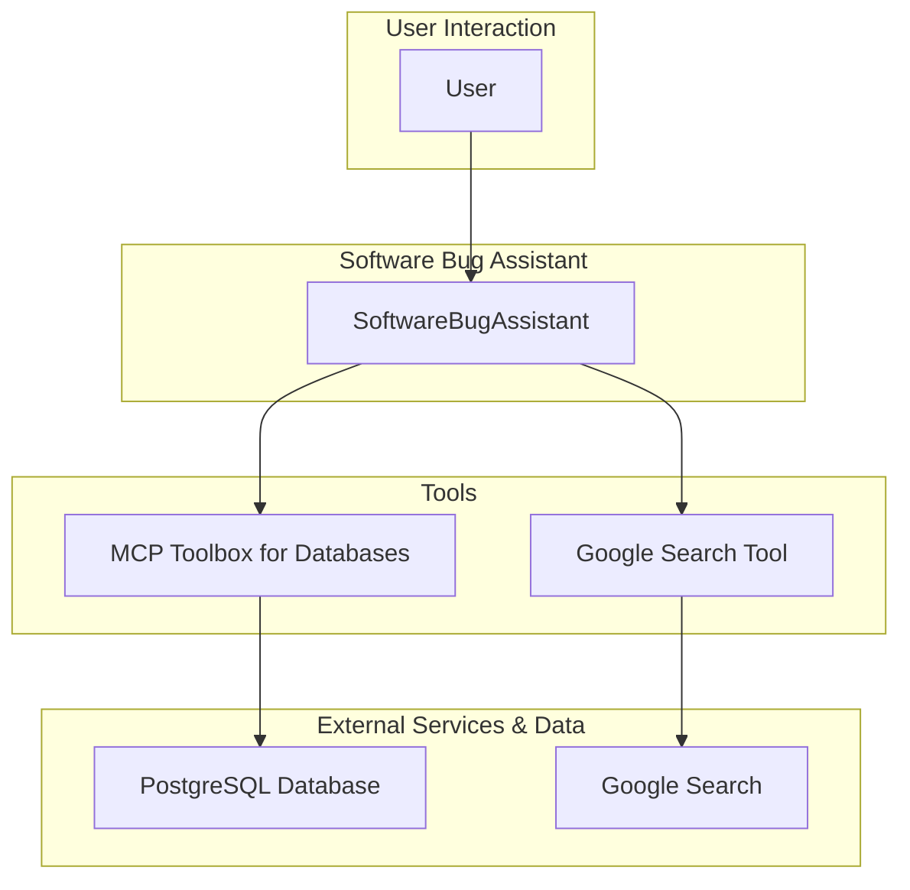

# Software Bug Assistant - Architectural Document

## 1. Overview

The Software Bug Assistant is a Java-based agent designed to assist IT Support and Software Developers in triaging, managing, and resolving software issues. It interacts with a PostgreSQL database of bug tickets and uses Google Search to aid in debugging.

## 2. Architectural Pattern: Single-Agent with a Toolbox

The agent follows a **Single-Agent with a Toolbox** pattern. A single `SoftwareBugAssistant` agent handles all interactions with the user, and it is equipped with a comprehensive set of tools to perform various tasks related to bug tracking and resolution.

### 2.1. Components

*   **Software Bug Assistant (`SoftwareBugAssistant`):** The core of the system, responsible for:
    *   Interacting with the user in a conversational manner.
    *   Understanding the user's needs and intent related to software bugs.
    *   Selecting and executing the appropriate tools to fulfill the user's requests.
    *   Managing the conversation flow and maintaining context.

*   **MCP Toolbox for Databases:** A Model Context Protocol (MCP) server that provides a set of "tools" for interacting with the PostgreSQL database. These tools are mapped to SQL queries, allowing the agent to perform actions like:
    *   Creating new bug tickets.
    *   Updating existing tickets.
    *   Searching for tickets by description, status, or assignee.

*   **Google Search Tool:** A tool that allows the agent to perform web searches to find information relevant to debugging and resolving software issues.

*   **PostgreSQL Database:** A relational database that stores the bug tickets in a `tickets` table.

## 3. Detailed Workflow and Data Flow

The following diagram illustrates the detailed workflow and data flow of the agent:

### 3.1. Step-by-Step Workflow

1.  **User Request:** The user submits a request to the `SoftwareBugAssistant` (e.g., "Find all open bugs assigned to me," "Create a new bug for a login issue").

2.  **Intent Recognition:** The agent analyzes the user's request to understand their intent.

3.  **Tool Selection and Execution:** Based on the user's intent, the agent selects and executes the appropriate tool(s):
    *   For database operations (creating, updating, or searching for bug tickets), the agent calls the relevant tool from the **MCP Toolbox**.
    *   For research or debugging, the agent uses the **Google Search Tool**.

4.  **Response Generation:** The agent uses the output from the tools to generate a response to the user, often formatting the results in a human-readable format (e.g., a markdown table for a list of bugs).

5.  **Conversation Management:** The agent maintains the context of the conversation, allowing for follow-up questions and a natural interaction.

## 4. Implementation Details

*   **Framework:** The agent is built using the ADK for Java.
*   **Model:** The language model used for the agent is a Gemini model.
*   **Database Integration:** The agent connects to the PostgreSQL database via the MCP Toolbox for Databases.
