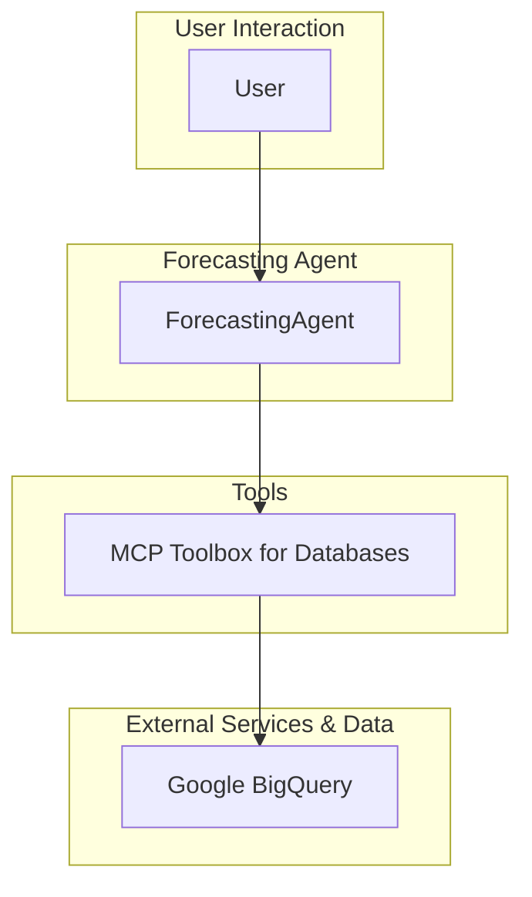

# Time Series Forecasting Agent - Architectural Document

## 1. Overview

The Time Series Forecasting Agent is a Java-based agent designed to perform time series forecasting using Google BigQuery. It leverages an MCP Toolbox server to access and execute forecasting tools defined as SQL queries, and it uses a Large Language Model (LLM) to understand user requests and provide insightful analysis of the forecast results.

## 2. Architectural Pattern: Single-Agent with a Toolbox

The agent follows a **Single-Agent with a Toolbox** pattern. A single `ForecastingAgent` handles all interactions with the user, and it is equipped with a set of tools for performing time series forecasting tasks.

### 2.1. Components

*   **Forecasting Agent (`ForecastingAgent`):** The core of the system, responsible for:
    *   Interacting with the user in a conversational manner.
    *   Understanding the user's forecasting requests.
    *   Selecting and executing the appropriate forecasting tool from the MCP Toolbox.
    *   Analyzing the forecast results and providing qualitative insights.

*   **MCP Toolbox for Databases:** A Model Context Protocol (MCP) server that provides a set of "tools" for interacting with Google BigQuery. These tools are defined as parameterized SQL queries in a `tools.yaml` file and leverage BigQuery ML's `AI.FORECAST` function.

*   **Google BigQuery:** The data warehouse and machine learning platform where the time series data is stored and the forecasting is performed.

## 3. Detailed Workflow and Data Flow

The following diagram illustrates the detailed workflow and data flow of the agent:

### 3.1. Step-by-Step Workflow

1.  **User Request:** The user submits a forecasting request to the `ForecastingAgent` (e.g., "forecast liquor sales for next week").

2.  **Intent Recognition and Tool Selection:** The agent analyzes the user's request to understand the forecasting goal and selects the appropriate forecasting tool from the MCP Toolbox.

3.  **Parameter Determination:** The agent determines the necessary parameters for the selected tool, such as the forecast horizon, and performs any necessary unit conversions.

4.  **Tool Execution:** The agent calls the selected tool from the MCP Toolbox, which in turn executes the corresponding SQL query against BigQuery.

5.  **Forecasting:** BigQuery performs the time series forecasting using the `AI.FORECAST` function and returns the results.

6.  **Response Generation and Analysis:** The agent receives the forecast results, formats them in a human-readable way, and provides qualitative analysis and insights based on its data science expertise.

## 4. Implementation Details

*   **Framework:** The agent is built using the ADK for Java.
*   **Model:** The language model used for the agent is a Gemini model.
*   **Database Integration:** The agent connects to Google BigQuery via the MCP Toolbox for Databases.
