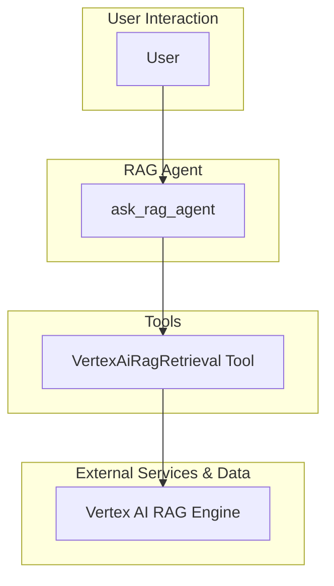

# RAG Agent - Architectural Document

## 1. Overview

The RAG (Retrieval-Augmented Generation) Agent is a conversational AI designed to answer questions related to documents uploaded to the Vertex AI RAG Engine. It utilizes RAG to fetch relevant documentation snippets and code references, which are then synthesized by an LLM (Gemini) to provide informative answers with citations.

## 2. Architectural Pattern: Single-Agent with a Retrieval Tool

The agent follows a **Single-Agent with a Retrieval Tool** pattern. A single `ask_rag_agent` handles all interactions with the user, and it is equipped with a `VertexAiRagRetrieval` tool to fetch information from a Vertex AI RAG Engine corpus.

### 2.1. Components

*   **RAG Agent (`ask_rag_agent`):** The core of the system, responsible for:
    *   Interacting with the user in a conversational manner.
    *   Understanding the user's questions.
    *   Using the `VertexAiRagRetrieval` tool to fetch relevant information from the RAG corpus.
    *   Synthesizing the retrieved information to generate an accurate answer with citations.

*   **Vertex AI RAG Retrieval Tool:** A tool that connects to the Vertex AI RAG Engine to:
    *   Retrieve relevant documentation snippets and code references based on the user's query.
    *   Provide citations for the retrieved content.

*   **Vertex AI RAG Engine:** A managed service that allows you to build RAG-based applications. It stores and indexes the documents that the agent can query.

## 3. Detailed Workflow and Data Flow

The following diagram illustrates the detailed workflow and data flow of the agent:

### 3.1. Step-by-Step Workflow

1.  **User Query:** The user submits a question to the `ask_rag_agent`.

2.  **Retrieval:** The agent uses the `VertexAiRagRetrieval` tool to query the Vertex AI RAG Engine and retrieve relevant document snippets.

3.  **Synthesis:** The agent synthesizes the retrieved information with its internal knowledge to generate an accurate and informative answer.

4.  **Citation:** The agent includes citations in its response, pointing back to the source documents in the RAG corpus.

## 4. Implementation Details

*   **Framework:** The agent is built using the ADK (Agent Development Kit).
*   **Model:** The language model used for the agent is a Gemini model.
*   **Retrieval:** The agent uses the `VertexAiRagRetrieval` tool to connect to the Vertex AI RAG Engine.
