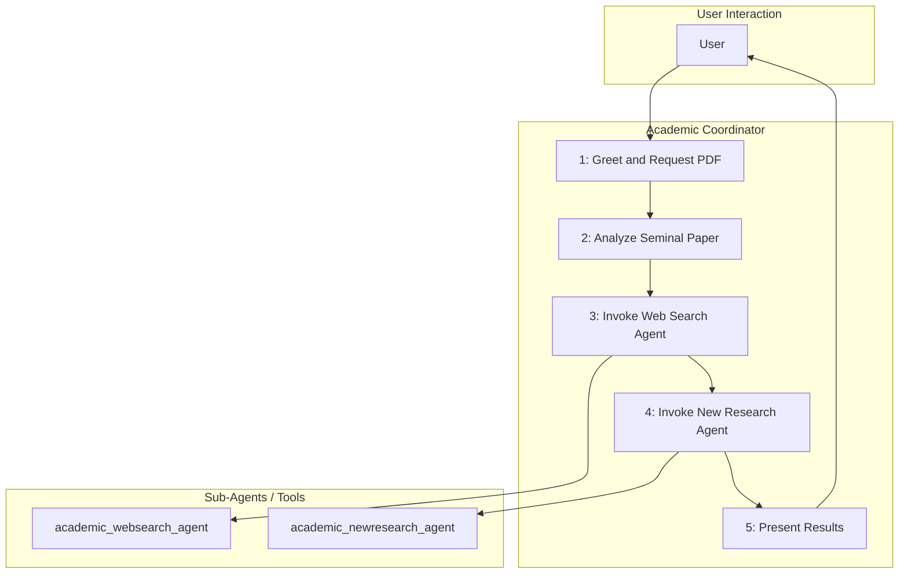

# Academic Research Agent - Architectural Document

## 1. Overview

The Academic Research Agent is an AI-driven system designed to assist researchers in exploring the academic landscape surrounding a seminal research paper. The agent analyzes a provided paper, identifies recent citing literature, and suggests future research directions. This process is orchestrated by a multi-agent system, where a coordinator agent manages the workflow and delegates specific tasks to specialized sub-agents.

## 2. Architectural Pattern: Orchestrator-Worker

The agent follows an **Orchestrator-Worker** pattern, a common architectural style for building complex agentic workflows. In this pattern, a central orchestrator (the "coordinator") manages the overall flow of execution, while specialized worker agents (the "sub-agents") perform specific, well-defined tasks.

This pattern is analogous to the **Graph-Based** or **State Machine** patterns in LangGraph, where the coordinator acts as a node that transitions between states (e.g., "analyzing seminal paper," "searching for recent papers," "suggesting new research"), and the sub-agents are the tools or services called within those states.

### 2.1. Components

*   **Academic Coordinator (`academic_coordinator`):** The orchestrator of the system. It is responsible for:
    *   Interacting with the user.
    *   Analyzing the seminal paper provided by the user.
    *   Invoking the `academic_websearch_agent` to find recent citing papers.
    *   Invoking the `academic_newresearch_agent` to generate future research directions.
    *   Formatting and presenting the results to the user.

*   **Academic Web Search Agent (`academic_websearch_agent`):** A specialized worker agent responsible for searching the web for recent academic publications that cite the seminal paper. It takes the seminal paper's details as input and returns a list of citing papers.

*   **Academic New Research Agent (`academic_newresearch_agent`):** A specialized worker agent that synthesizes the information from the seminal paper and the recent citing literature to propose potential future research directions.

## 3. Detailed Workflow and Data Flow

The following diagram illustrates the detailed workflow and data flow between the agents:

### 3.1. Step-by-Step Workflow

1.  **Initiation:** The `academic_coordinator` greets the user and requests a seminal paper in PDF format.

2.  **Seminal Paper Analysis:**
    *   The user provides the PDF file.
    *   The `academic_coordinator` analyzes the paper, extracting key information such as the title, authors, abstract, summary, keywords, innovations, and references.
    *   This information is presented to the user.

3.  **Find Recent Citing Papers:**
    *   The `academic_coordinator` informs the user that it will now search for recent citing papers.
    *   It invokes the `academic_websearch_agent`, passing the seminal paper's details as input.
    *   The `academic_websearch_agent` uses its tools (e.g., Google Search) to find relevant papers and returns a list to the coordinator.
    *   The `academic_coordinator` presents this list to the user.

4.  **Suggest Future Research Directions:**
    *   The `academic_coordinator` informs the user that it will now suggest future research directions.
    *   It invokes the `academic_newresearch_agent`, providing the analysis of the seminal paper and the list of recent citing papers as input.
    *   The `academic_newresearch_agent` synthesizes this information and generates a list of potential research directions.
    *   The `academic_coordinator` presents these suggestions to the user.

5.  **Conclusion:** The `academic_coordinator` concludes the interaction, offering further assistance.

## 4. Prompts and Instructions

The behavior of the agents is guided by detailed prompts. The `ACADEMIC_COORDINATOR_PROMPT` is particularly important, as it defines the entire workflow for the `academic_coordinator`. This prompt specifies the exact steps to follow, the information to extract, the tools to use, and the format of the output.

## 5. Implementation Details

*   **Framework:** The agent is built using the ADK (Agent Development Kit).
*   **Model:** The language model used for the agents is a Gemini model.
*   **Tools:** The sub-agents are exposed as tools to the coordinator using the `AgentTool` class from the ADK.
