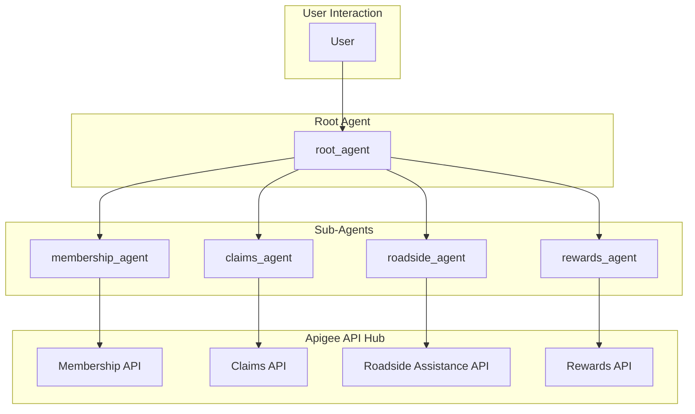

# Auto Insurance Agent - Architectural Document

## 1. Overview

The Auto Insurance Agent is a conversational AI assistant for an auto insurance company. It can register new members and perform various functions for existing members, such as filing claims, providing roadside assistance, and retrieving information about reward offers. The agent leverages a multi-agent architecture and integrates with external APIs via Apigee API Hub.

## 2. Architectural Pattern: Hierarchical Multi-Agent System

The agent is structured as a **Hierarchical Multi-Agent System**, where a `root_agent` acts as a central coordinator, and several specialized sub-agents handle specific tasks. This is a form of the **Orchestrator-Worker** pattern, where the `root_agent` orchestrates the overall conversation and delegates tasks to the appropriate worker (sub-agent).

This hierarchical structure allows for a clear separation of concerns, making the system easier to develop, maintain, and extend. Each sub-agent has a specific set of responsibilities and is equipped with the necessary tools to perform its tasks.

### 2.1. Components

*   **Root Agent (`root_agent`):** The main customer service assistant. It is responsible for:
    *   Greeting the user and identifying their needs.
    *   Looking up existing members or signing up new ones.
    *   Delegating tasks to the appropriate sub-agent based on the user's request.
    *   Managing the overall conversation flow.

*   **Membership Agent (`membership_agent`):** A sub-agent specialized in handling new member registrations.

*   **Claims Agent (`claims_agent`):** A sub-agent specialized in opening new insurance claims.

*   **Roadside Assistance Agent (`roadside_agent`):** A sub-agent specialized in providing roadside assistance services.

*   **Rewards Agent (`rewards_agent`):** A sub-agent specialized in finding nearby reward offers from partner companies.

*   **APIHubToolset:** A tool from the ADK that allows the agent to easily integrate with APIs registered in Apigee API Hub. Each sub-agent uses an `APIHubToolset` to interact with the corresponding external API (e.g., the `claims_agent` uses the Claims API).

*   **Apigee:** The API management platform that serves the custom APIs used by the agent.

*   **Google Secret Manager:** Used to securely store and manage the API keys required to authenticate with the Apigee APIs.

## 3. Detailed Workflow and Data Flow

The following diagram illustrates the detailed workflow and data flow between the agents and the external APIs:

### 3.1. Step-by-Step Workflow

1.  **Initiation:** The `root_agent` greets the user and asks for their member ID.

2.  **Member Identification:**
    *   If the user provides a member ID, the `root_agent` uses the `membership` tool (via the Membership API) to look up the user's account information.
    *   If the user is not a member, the `root_agent` offers to sign them up and delegates the task to the `membership_agent`.

3.  **Task Delegation:** Once the user is identified, the `root_agent` asks how it can help. Based on the user's request, it delegates the task to the appropriate sub-agent:
    *   **Claims:** If the user wants to file a claim, the `root_agent` transfers the conversation to the `claims_agent`. The `claims_agent` then uses the `claims` tool (Claims API) to open a new claim.
    *   **Roadside Assistance:** If the user needs roadside assistance, the `root_agent` transfers the conversation to the `roadside_agent`. The `roadside_agent` uses the `roadsideAssistance` tool (Roadside Assistance API) to create a new service request.
    *   **Rewards:** If the user wants to find reward offers, the `root_agent` transfers the conversation to the `rewards_agent`. The `rewards_agent` uses the `rewards` tool (Rewards API) to find nearby offers.

4.  **Task Completion:** After the sub-agent has completed its task, it transfers the conversation back to the `root_agent`.

5.  **Conclusion:** The `root_agent` asks if there is anything else it can help with. If not, it politely concludes the conversation.

## 4. Implementation Details

*   **Framework:** The agent is built using the ADK (Agent Development Kit).
*   **Model:** The language model used for the agents is a Gemini model.
*   **Tools:** The agent uses the `APIHubToolset` to connect to external APIs managed by Apigee.
*   **Authentication:** API key authentication is used to secure the APIs, with the keys stored in Google Secret Manager.
