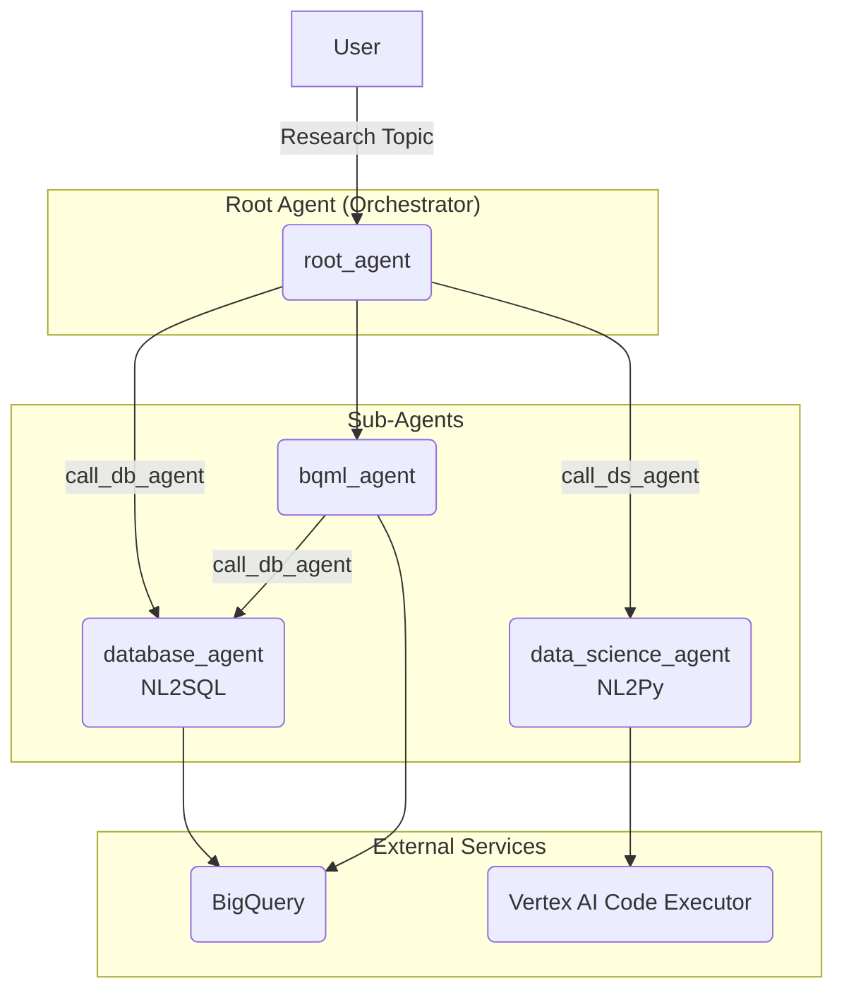

# Data Science Agent - Architectural Document

## 1. Overview

The Data Science Agent is a multi-agent system designed for advanced data analysis. It integrates specialized agents to handle various aspects of the data pipeline, including data retrieval from BigQuery, data analysis and visualization with Python, and machine learning with BigQuery ML (BQML).

## 2. Architectural Pattern: Orchestrator with Specialized Sub-Agents

The system follows an **Orchestrator with Specialized Sub-Agents** pattern. A `root_agent` acts as the central orchestrator, managing the overall workflow and delegating tasks to a set of specialized sub-agents. This modular architecture allows for a clear separation of concerns and enables the system to handle complex data analysis tasks.

### 2.1. Components

*   **Root Agent (`root_agent`):** The central orchestrator of the system. It is responsible for:
    *   Interacting with the user.
    *   Delegating tasks to the `database_agent`, `data_science_agent`, and `bqml_agent`.
    *   Managing the overall workflow and data flow between the agents.

*   **Database Agent (`database_agent`):** A specialized sub-agent responsible for:
    *   Translating natural language queries into SQL.
    *   Executing SQL queries against a BigQuery database.
    *   Returning the results to the `root_agent`.

*   **Data Science Agent (`data_science_agent`):** A specialized sub-agent that uses a code interpreter to:
    *   Perform data analysis and manipulation using Python.
    *   Generate data visualizations (plots, graphs, etc.).

*   **BQML Agent (`bqml_agent`):** A specialized sub-agent responsible for:
    *   Executing BQML code for training and evaluating machine learning models.
    *   Interacting with the `database_agent` to retrieve data for ML tasks.

*   **Tools:**
    *   **`call_db_agent`:** A tool used by the `root_agent` and `bqml_agent` to invoke the `database_agent`.
    *   **`call_ds_agent`:** A tool used by the `root_agent` to invoke the `data_science_agent`.

## 3. Detailed Workflow and Data Flow

The following diagram illustrates the detailed workflow and data flow between the agents:

### 3.1. Step-by-Step Workflow

1.  **User Request:** The user submits a request to the `root_agent` (e.g., "Show me the total sales per country").

2.  **Task Delegation:** The `root_agent` analyzes the request and delegates the task to the appropriate sub-agent:
    *   **For data retrieval:** The `root_agent` calls the `database_agent` (via the `call_db_agent` tool) to query the BigQuery database.
    *   **For data analysis/visualization:** The `root_agent` calls the `data_science_agent` (via the `call_ds_agent` tool) to execute Python code.
    *   **For machine learning:** The `root_agent` calls the `bqml_agent` to perform BQML tasks.

3.  **Sub-Agent Execution:** The sub-agents perform their specialized tasks:
    *   The `database_agent` generates and executes a SQL query.
    *   The `data_science_agent` generates and executes Python code for analysis or visualization.
    *   The `bqml_agent` executes BQML code and may call the `database_agent` to get data.

4.  **Response Generation:** The `root_agent` receives the results from the sub-agents and presents them to the user.

## 4. Implementation Details

*   **Framework:** The agent is built using the ADK (Agent Development Kit).
*   **Model:** The language models for the agents are Gemini models.
*   **Tools:** The `root_agent` uses `AgentTool` to interact with the sub-agents.
*   **Code Execution:** The `data_science_agent` uses the `VertexAiCodeExecutor` to run Python code.
