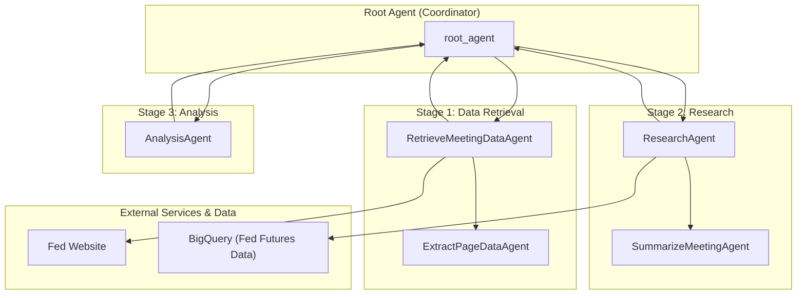

# FOMC Research Agent - Architectural Document

## 1. Overview

The FOMC Research Agent is a multi-agent, multi-modal system designed to generate detailed analysis reports on the latest meetings of the Federal Open Market Committee (FOMC). The agent follows a largely non-conversational, multi-stage workflow, with sub-agents interacting with each other to produce the final report.

## 2. Architectural Pattern: Multi-Stage Pipeline with a Coordinator

The system is structured as a **Multi-Stage Pipeline with a Coordinator**. A `root_agent` orchestrates the overall workflow, which is divided into three main stages: data retrieval, research, and analysis. Each stage is handled by a specialized sub-agent, and the output of one stage serves as the input for the next.

### 2.1. Components

*   **Root Agent (`root_agent`):** The central orchestrator of the system. It is responsible for:
    *   Initiating the workflow.
    *   Invoking the sub-agents for each stage of the pipeline.
    *   Managing the data flow between the agents.

*   **Retrieve Meeting Data Agent (`RetrieveMeetingDataAgent`):** The first stage in the pipeline, responsible for:
    *   Fetching FOMC meeting data from the web using the `fetch_page_tool`.
    *   Orchestrating the `ExtractPageDataAgent` to extract specific data from the retrieved web pages.

*   **Research Agent (`ResearchAgent`):** The second stage in the pipeline, responsible for:
    *   Coordinating the retrieval of individual research components.
    *   Using tools to compare FOMC statements, compute rate move probabilities from Fed Futures pricing, and fetch meeting transcripts.
    *   Orchestrating the `SummarizeMeetingAgent` to summarize the meeting transcript.

*   **Analysis Agent (`AnalysisAgent`):** The final stage in the pipeline, responsible for:
    *   Taking the output of the `ResearchAgent` as input.
    *   Generating a detailed analysis report on the FOMC meeting.

*   **Other Sub-Agents:**
    *   **`ExtractPageDataAgent`:** Extracts specific data from an HTML page.
    *   **`SummarizeMeetingAgent`:** Reads the meeting transcript and generates a summary.

*   **Tools:**
    *   **`fetch_page_tool`:** Encapsulates an HTTP request for retrieving a web page.
    *   **`store_state_tool`:** Stores specific information in the `ToolContext`.
    *   **`compare_statements_tool`:** Compares the current and previous FOMC statements.
    *   **`compute_rate_move_probability_tool`:** Computes the probability of rate changes from Fed Futures pricing.
    *   **`fetch_transcript_tool`:** Retrieves the FOMC meeting transcript.

## 3. Detailed Workflow and Data Flow

The following diagram illustrates the detailed workflow and data flow between the agents:

### 3.1. Step-by-Step Workflow

1.  **Data Retrieval:** The `root_agent` invokes the `RetrieveMeetingDataAgent`, which fetches the FOMC meeting data from the web and extracts the relevant information.

2.  **Research:** The `root_agent` passes the retrieved data to the `ResearchAgent`, which performs a detailed analysis, including comparing statements, computing probabilities, and summarizing the transcript.

3.  **Analysis Report:** The `root_agent` sends the research output to the `AnalysisAgent`, which generates the final, comprehensive analysis report.

## 4. Implementation Details

*   **Framework:** The agent is built using the ADK (Agent Development Kit).
*   **Model:** The language model used for the agents is a Gemini model.
*   **Tools:** The agent uses a variety of custom tools for web scraping, data analysis, and state management.
