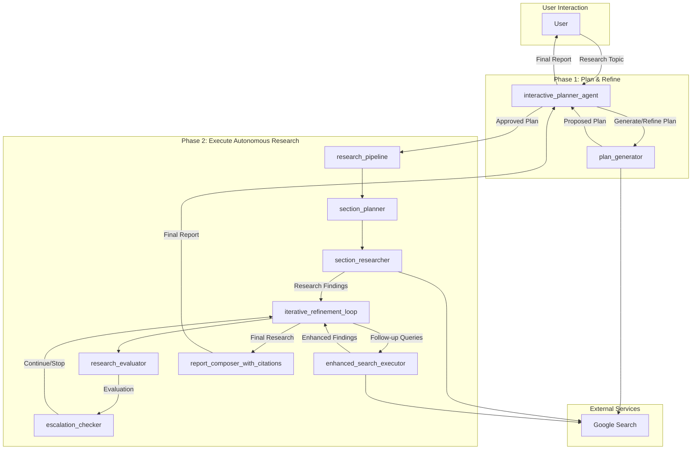

# Gemini Fullstack Agent - Architectural Document

## 1. Overview

The Gemini Fullstack Agent is a production-ready blueprint for building a sophisticated, full-stack research agent with Gemini. It features a React frontend and a FastAPI backend powered by the ADK. The agent follows a two-phase workflow: a collaborative planning phase with human-in-the-loop, and an autonomous research and report generation phase.

## 2. Architectural Pattern: Two-Phase Workflow with a Coordinator and a Pipeline

The system is architected around a **Two-Phase Workflow with a Coordinator and a Pipeline**. An `interactive_planner_agent` acts as the central coordinator, managing the interaction with the user and orchestrating the two main phases of the workflow.

*   **Phase 1: Plan & Refine (Human-in-the-Loop):** A collaborative brainstorming phase where the agent and the user work together to create and refine a research plan.
*   **Phase 2: Execute Autonomous Research:** An autonomous phase where a `research_pipeline` agent executes the approved plan, performs iterative research, and generates a final report.

### 2.1. Components

*   **Interactive Planner Agent (`interactive_planner_agent`):** The central coordinator of the system. It is responsible for:
    *   Interacting with the user to create and refine a research plan.
    *   Using the `plan_generator` agent to generate the initial plan.
    *   Delegating the execution of the approved plan to the `research_pipeline`.

*   **Plan Generator Agent (`plan_generator`):** A sub-agent responsible for generating and refining the research plan based on user input.

*   **Research Pipeline (`research_pipeline`):** A `SequentialAgent` that executes the autonomous research phase. It consists of the following sub-agents:
    *   **Section Planner (`section_planner`):** Creates a structured markdown outline for the final report.
    *   **Section Researcher (`section_researcher`):** Performs the initial web research based on the approved plan.
    *   **Iterative Refinement Loop (`iterative_refinement_loop`):** A `LoopAgent` that iteratively refines the research until it meets a quality threshold. It contains:
        *   **Research Evaluator (`research_evaluator`):** A "critic" agent that evaluates the quality of the research and provides feedback.
        *   **Escalation Checker (`escalation_checker`):** A custom agent that stops the loop if the research is approved.
        *   **Enhanced Search Executor (`enhanced_search_executor`):** Executes follow-up searches to address any gaps identified by the `research_evaluator`.
    *   **Report Composer (`report_composer_with_citations`):** Composes the final, polished report with inline citations.

*   **Tools:**
    *   **Google Search:** Used by the `plan_generator` and `section_researcher` for web searches.

## 3. Detailed Workflow and Data Flow

The following diagram illustrates the detailed workflow and data flow between the agents:

### 3.1. Step-by-Step Workflow

1.  **Planning:** The user provides a research topic to the `interactive_planner_agent`, which uses the `plan_generator` to create a research plan. The user can then refine the plan until they approve it.

2.  **Execution:** Once the plan is approved, the `interactive_planner_agent` delegates the task to the `research_pipeline`.

3.  **Outlining:** The `section_planner` creates a structured outline for the report.

4.  **Initial Research:** The `section_researcher` performs the initial web research.

5.  **Iterative Refinement:** The `iterative_refinement_loop` begins:
    *   The `research_evaluator` critiques the research.
    *   If the research is sufficient, the `escalation_checker` stops the loop.
    *   If not, the `enhanced_search_executor` performs follow-up searches.

6.  **Report Composition:** The `report_composer` takes the final research findings and generates a polished report with citations.

7.  **Output:** The `interactive_planner_agent` presents the final report to the user.

## 4. Implementation Details

*   **Framework:** The agent is built using the ADK (Agent Development Kit) for the backend and React for the frontend.
*   **Model:** The language models for the agents are Gemini models.
*   **Tools:** The agent uses the built-in `google_search` tool.
