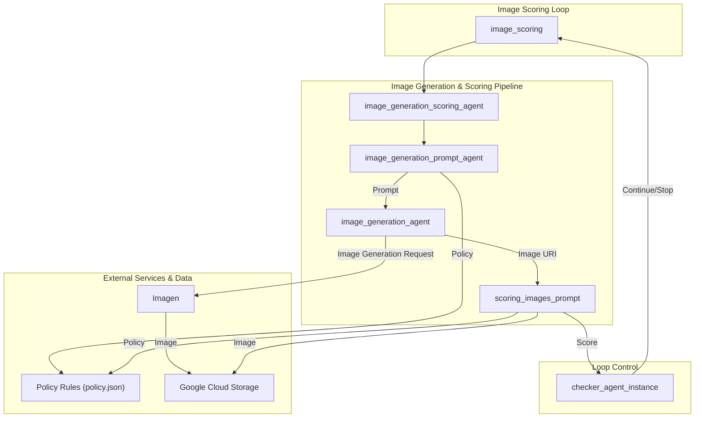

# Image Scoring Agent - Architectural Document

## 1. Overview

The Image Scoring Agent is a multi-agent system designed to generate and evaluate images based on text descriptions while ensuring compliance with predefined policies. It functions as an automated image generation and validation system, iteratively improving images until they meet specific quality and policy standards.

## 2. Architectural Pattern: Iterative Generation and Evaluation Loop

The system is architected as an **Iterative Generation and Evaluation Loop**. A `LoopAgent` named `image_scoring` serves as the root of the system, repeatedly executing a sequential process of image generation and scoring until a quality threshold is met or a maximum number of iterations is reached.

### 2.1. Components

*   **Image Scoring Loop Agent (`image_scoring`):** The root `LoopAgent` that orchestrates the iterative workflow. It contains two main sub-agents:
    *   **Image Generation and Scoring Agent (`image_generation_scoring_agent`):** A `SequentialAgent` that performs the core tasks of generating and scoring an image.
    *   **Checker Agent (`checker_agent_instance`):** An agent responsible for evaluating the image score and controlling the loop's execution.

*   **Image Generation and Scoring Agent (`image_generation_scoring_agent`):** A `SequentialAgent` that executes the following sub-agents in order:
    *   **Prompt Generation Agent (`image_generation_prompt_agent`):** Creates an optimized prompt for Imagen based on the input text description and predefined policies.
    *   **Image Generation Agent (`image_generation_agent`):** Generates an image using Imagen based on the prompt.
    *   **Scoring Agent (`scoring_images_prompt`):** Evaluates the generated image against the policy rules and assigns a score.

*   **Tools:**
    *   **`get_policy`:** A tool used by the `image_generation_prompt_agent` and `scoring_images_prompt` to fetch the predefined policies.
    *   **`generate_images`:** A tool used by the `image_generation_agent` to generate images with Imagen.
    *   **`get_image`:** A tool used by the `scoring_images_prompt` to retrieve the generated image for evaluation.
    *   **`set_score`:** A tool used by the `scoring_images_prompt` to store the evaluation score.

## 3. Detailed Workflow and Data Flow

The following diagram illustrates the detailed workflow and data flow between the agents:

### 3.1. Step-by-Step Workflow

1.  **Prompt Generation:** The `image_generation_scoring_agent` starts by invoking the `image_generation_prompt_agent`, which creates an optimized prompt for Imagen, ensuring it complies with the policies defined in `policy.json`.

2.  **Image Generation:** The `image_generation_agent` uses the generated prompt to create an image with Imagen and saves it to Google Cloud Storage.

3.  **Image Scoring:** The `scoring_images_prompt` agent retrieves the generated image and the policy rules, evaluates the image, and assigns a score.

4.  **Loop Control:** The `checker_agent_instance` checks the score against a predefined threshold.
    *   If the score is sufficient, the loop terminates.
    *   If the score is insufficient and the maximum number of iterations has not been reached, the loop continues from step 1.

## 4. Implementation Details

*   **Framework:** The agent is built using the ADK (Agent Development Kit).
*   **Model:** The language models for the agents are Gemini models.
*   **Tools:** The agent uses a variety of custom tools for interacting with Imagen, GCS, and the policy file.
