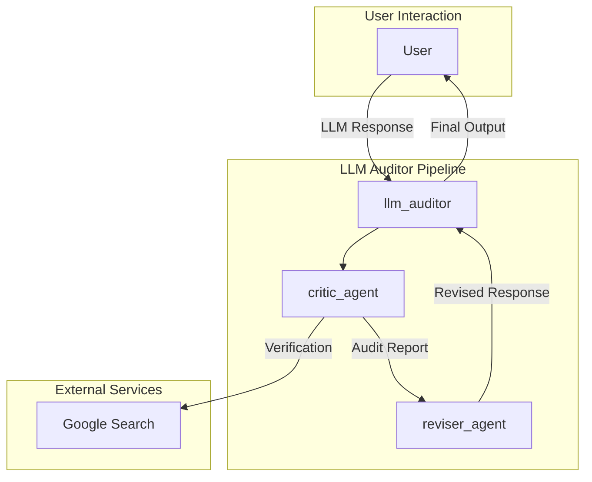

# LLM Auditor Agent - Architectural Document

## 1. Overview

The LLM Auditor is a multi-agent system that functions as an automated fact-checking layer for responses generated by Large Language Models (LLMs). It enhances the reliability of LLM outputs by systematically analyzing them against real-world information, identifying and verifying claims, producing a detailed audit report, and optionally rewriting the original response to correct inaccuracies.

## 2. Architectural Pattern: Critic-Reviser Pipeline

The system is architected as a **Critic-Reviser Pipeline**. An `llm_auditor` `SequentialAgent` orchestrates a two-stage workflow:

1.  **Critic Stage:** A `critic_agent` evaluates the LLM-generated response, identifies verifiable claims, and uses web search to determine their accuracy.
2.  **Reviser Stage:** A `reviser_agent` takes the findings of the `critic_agent` and rewrites the original response to correct any inaccuracies.

This pattern allows for a clear separation of concerns, with one agent focused on evaluation and another on revision.

### 2.1. Components

*   **LLM Auditor (`llm_auditor`):** The root `SequentialAgent` that orchestrates the critic-reviser pipeline.

*   **Critic Agent (`critic_agent`):** The first agent in the pipeline, responsible for:
    *   Identifying verifiable claims within an LLM-generated text.
    *   Using the `google_search` tool to determine the accuracy of the claims.
    *   Producing a detailed report on its findings.

*   **Reviser Agent (`reviser_agent`):** The second agent in the pipeline, responsible for:
    *   Taking the output of the `critic_agent` as input.
    *   Rewriting the original response to correct any discovered inaccuracies.

*   **Tools:**
    *   **Google Search:** Used by the `critic_agent` to verify claims.

## 3. Detailed Workflow and Data Flow

The following diagram illustrates the detailed workflow and data flow between the agents:

### 3.1. Step-by-Step Workflow

1.  **Input:** The `llm_auditor` receives an LLM-generated response from the user.

2.  **Critic Stage:** The `llm_auditor` passes the response to the `critic_agent`, which identifies verifiable claims and uses Google Search to verify them. The `critic_agent` then produces an audit report.

3.  **Reviser Stage:** The `llm_auditor` passes the audit report and the original response to the `reviser_agent`, which rewrites the response to correct any inaccuracies.

4.  **Output:** The `llm_auditor` presents the audit report and the revised response to the user.

## 4. Implementation Details

*   **Framework:** The agent is built using the ADK (Agent Development Kit).
*   **Model:** The language model used for the agents is a Gemini model.
*   **Tools:** The `critic_agent` uses the built-in `google_search` tool.
