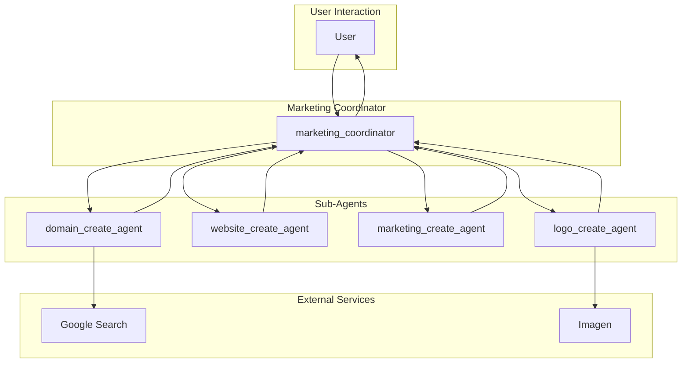

# Marketing Agency Agent - Architectural Document

## 1. Overview

The Marketing Agency Agent is a multi-agent system designed to assist creative agencies with launching new websites and products. It streamlines the entire launch lifecycle, from selecting a domain name to creating a website, generating marketing materials, and designing a logo.

## 2. Architectural Pattern: Sequential Pipeline with a Coordinator

The system is architected as a **Sequential Pipeline with a Coordinator**. A `marketing_coordinator` agent orchestrates the workflow, guiding the user through a structured process. Each step in the process is handled by a specialized sub-agent, and the output of one agent serves as the input for the next, forming a pipeline of information flow.

### 2.1. Components

*   **Marketing Coordinator (`marketing_coordinator`):** The central orchestrator of the system. It is responsible for:
    *   Interacting with the user and guiding them through the marketing workflow.
    *   Invoking the specialized sub-agents in the correct order.
    *   Managing the data flow between the agents.

*   **Domain Create Agent (`domain_create_agent`):** A specialized sub-agent that:
    *   Uses Google Search to suggest available domain names based on user-provided keywords.

*   **Website Create Agent (`website_create_agent`):** A specialized sub-agent that:
    *   Generates the HTML, CSS, and JavaScript for a new website based on the user's requirements.

*   **Marketing Create Agent (`marketing_create_agent`):** A specialized sub-agent that:
    *   Develops a comprehensive marketing strategy, including target audience personas, a SWOT analysis, and recommended marketing channels.

*   **Logo Create Agent (`logo_create_agent`):** A specialized sub-agent that:
    *   Uses Imagen to generate a logo for the new brand.

*   **Tools:**
    *   **Google Search:** Used by the `domain_create_agent` to find available domain names.
    *   **Imagen:** Used by the `logo_create_agent` to generate logos.

## 3. Detailed Workflow and Data Flow

The following diagram illustrates the detailed workflow and data flow between the agents:

### 3.1. Step-by-Step Workflow

1.  **Domain Selection:** The `marketing_coordinator` starts by invoking the `domain_create_agent` to help the user select an optimal domain name.

2.  **Website Creation:** Once a domain is selected, the `marketing_coordinator` calls the `website_create_agent` to generate the website.

3.  **Marketing Strategy:** Next, the `marketing_coordinator` invokes the `marketing_create_agent` to develop a comprehensive marketing strategy.

4.  **Logo Design:** Finally, the `marketing_coordinator` calls the `logo_create_agent` to design a logo for the new brand.

5.  **Output:** The `marketing_coordinator` presents the final website, marketing materials, and logo to the user.

## 4. Implementation Details

*   **Framework:** The agent is built using the ADK (Agent Development Kit).
*   **Model:** The language model used for the agents is a Gemini model.
*   **Tools:** The agent uses the built-in `google_search` tool and a custom tool for generating images with Imagen.
