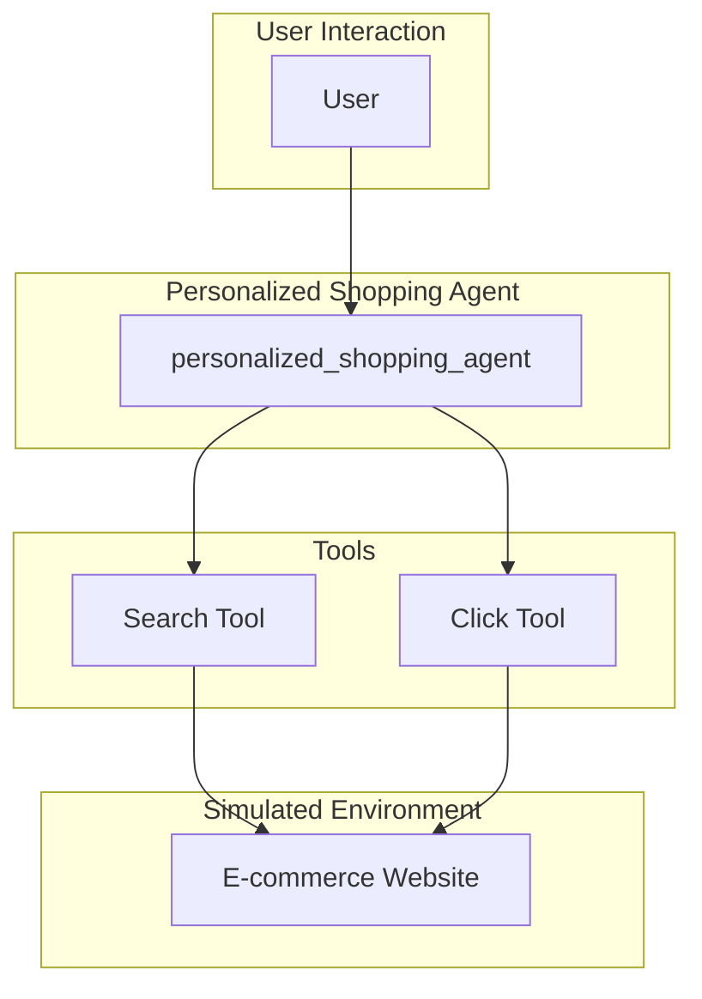

# Personalized Shopping Agent - Architectural Document

## 1. Overview

The Personalized Shopping Agent is a conversational AI designed to provide tailored product recommendations within a specific e-commerce environment. It enhances the shopping experience by navigating a product catalog, performing text and image-based searches, and recommending products based on user behavior and profile data.

## 2. Architectural Pattern: Single-Agent with a Toolbox in a Simulated Environment

The agent follows a **Single-Agent with a Toolbox** pattern, operating within a **Simulated Environment**. A single `personalized_shopping_agent` handles all interactions with the user, and it is equipped with a set of tools to interact with a simulated e-commerce website.

### 2.1. Components

*   **Personalized Shopping Agent (`personalized_shopping_agent`):** The core of the system, responsible for:
    *   Interacting with the user in a conversational manner.
    *   Understanding the user's shopping needs and preferences.
    *   Using the `search` and `click` tools to navigate the e-commerce environment and find suitable products.
    *   Providing personalized product recommendations.

*   **Simulated E-commerce Environment:** A web environment pre-indexed with a large product catalog. The agent interacts with this environment to gather product information and make recommendations.

*   **Tools:**
    *   **`search`:** A tool that allows the agent to perform keyword-based searches for products within the simulated environment.
    *   **`click`:** A tool that allows the agent to navigate the simulated website by clicking on buttons and links.

## 3. Detailed Workflow and Data Flow

The following diagram illustrates the detailed workflow and data flow of the agent:

### 3.1. Step-by-Step Workflow

1.  **User Request:** The user submits a request to the `personalized_shopping_agent` (e.g., "I'm looking for a summer dress," or provides an image of a product).

2.  **Intent Recognition:** The agent analyzes the user's request to understand their intent and product preferences.

3.  **Tool Selection and Execution:** Based on the user's request, the agent selects and executes the appropriate tool(s):
    *   The agent uses the **`search`** tool to find products that match the user's text or image-based query.
    *   The agent uses the **`click`** tool to navigate to product pages, view details, and explore related items.

4.  **Response Generation:** The agent uses the information gathered from the simulated environment to generate a response to the user, providing personalized product recommendations and answering any questions.

5.  **Conversation Management:** The agent maintains a conversational memory to keep track of the user's preferences and the products they have viewed, allowing for a more personalized and context-aware shopping experience.

## 4. Implementation Details

*   **Framework:** The agent is built using the ADK (Agent Development Kit).
*   **Model:** The language model used for the agent is a Gemini model.
*   **Environment:** The agent uses a simulated webshop environment from [princeton-nlp/WebShop](https://github.com/princeton-nlp/WebShop).
