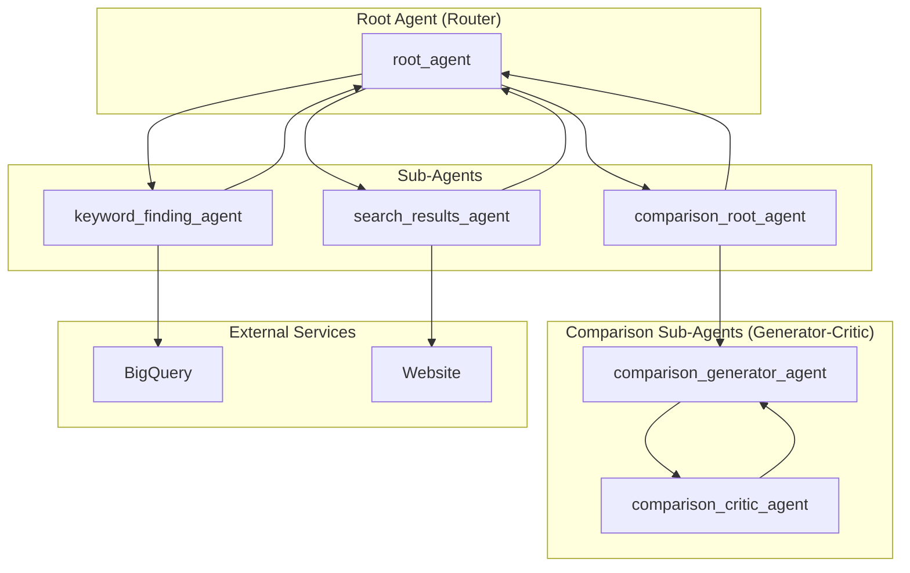

# Brand Search Optimization Agent - Architectural Document

## 1. Overview

The Brand Search Optimization Agent is a sophisticated AI system designed to enhance product data for retail websites. It generates keywords from product data, crawls a website to analyze search results, and provides suggestions for enriching product titles. This helps to improve product discoverability and address issues like "null and low recovery" searches. The agent employs a multi-agent architecture, integrating with BigQuery for data retrieval and using Selenium for web crawling.

## 2. Architectural Pattern: Router-Based Multi-Agent System

The agent is structured as a **Router-Based Multi-Agent System**. A `root_agent` acts as a central router, directing user requests and intermediate tasks to the appropriate specialized sub-agent. This modular architecture allows for a clear separation of concerns and facilitates the management of a complex workflow.

The overall pattern can be described as a **Pipeline** or **Workflow** where the output of one agent becomes the input for the next, orchestrated by the `root_agent`.

### 2.1. Components

*   **Root Agent (`root_agent`):** The central router and orchestrator of the system. It is responsible for:
    *   Managing the overall workflow.
    *   Delegating tasks to the `keyword_finding_agent`, `search_results_agent`, and `comparison_root_agent`.

*   **Keyword Finding Agent (`keyword_finding_agent`):** A specialized sub-agent responsible for:
    *   Querying a BigQuery database to retrieve product data for a given brand.
    *   Generating a list of relevant keywords based on the product data.

*   **Search Results Agent (`search_results_agent`):** A web-crawling sub-agent that uses Selenium to:
    *   Navigate to a specified website.
    *   Search for the keywords generated by the `keyword_finding_agent`.
    *   Analyze the top search results and extract relevant information (e.g., product titles).

*   **Comparison Root Agent (`comparison_root_agent`):** A multi-agent system that follows a **Generator-Critic** pattern. It is responsible for comparing the original product titles with the titles from the search results.
    *   **Comparison Generator Agent (`comparison_generator_agent`):** Generates a comparison of the product titles.
    *   **Comparison Critic Agent (`comparsion_critic_agent`):** Critiques the comparison generated by the generator agent, providing feedback for improvement.

*   **Tools:**
    *   **BigQuery Connector:** A tool used by the `keyword_finding_agent` to connect to and query a BigQuery database.
    *   **Web Crawling Tools:** A suite of tools based on Selenium, used by the `search_results_agent` for web navigation, interaction, and data extraction.

## 3. Detailed Workflow and Data Flow

The following diagram illustrates the detailed workflow and data flow between the agents:

### 3.1. Step-by-Step Workflow

1.  **Keyword Generation:** The `root_agent` delegates the task of keyword generation to the `keyword_finding_agent`. The `keyword_finding_agent` queries the BigQuery database to get product data and generates a list of keywords.

2.  **Web Search and Analysis:** The `root_agent` passes the generated keywords to the `search_results_agent`. The `search_results_agent` crawls the specified website, searches for the keywords, and extracts the top search results.

3.  **Comparison and Suggestions:** The `root_agent` sends the original product data and the search results to the `comparison_root_agent`. The `comparison_root_agent` orchestrates the `comparison_generator_agent` and `comparsion_critic_agent` to generate and refine a comparison of the product titles, providing suggestions for enrichment.

4.  **Output:** The `root_agent` presents the final suggestions to the user.

## 4. Implementation Details

*   **Framework:** The agent is built using the ADK (Agent Development Kit).
*   **Model:** The language model used for the agents is a Gemini model.
*   **Tools:** The agent uses a custom BigQuery connector and a suite of web-crawling tools built on Selenium.
