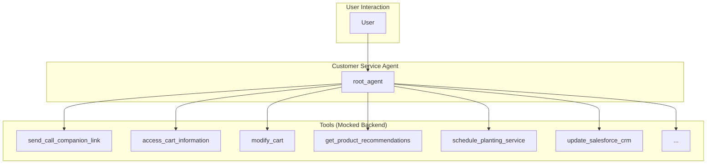

# Customer Service Agent - Architectural Document

## 1. Overview

The Customer Service Agent for Cymbal Home & Garden is a conversational AI designed to provide a personalized and efficient shopping experience. It assists customers with product selection, order management, service scheduling, and personalized recommendations. The agent is multi-modal, capable of handling both text and video inputs, and uses a variety of tools to perform its functions.

## 2. Architectural Pattern: Single-Agent with a Toolbox

The agent follows a **Single-Agent with a Toolbox** pattern. A single `root_agent` handles all interactions with the user, and it is equipped with a comprehensive set of tools to perform various tasks. This is a straightforward and effective pattern for agents that need to perform a wide range of functions without the need for complex multi-agent orchestration.

### 2.1. Components

*   **Root Agent (`root_agent`):** The core of the system, responsible for:
    *   Interacting with the user in a conversational manner.
    *   Understanding the user's needs and intent.
    *   Selecting and executing the appropriate tools to fulfill the user's requests.
    *   Managing the conversation flow and maintaining context.

*   **Tools:** A collection of functions that the agent can call to perform specific actions. These tools are mocked, meaning they simulate interactions with backend systems without actually connecting to them. The tools include functionalities for:
    *   **Communication:** Sending video call links.
    *   **Order Management:** Accessing and modifying the shopping cart.
    *   **Product Information:** Getting product recommendations and checking availability.
    *   **Service Scheduling:** Scheduling appointments and checking available times.
    *   **Customer Relationship Management (CRM):** Updating customer records.
    *   **Promotions:** Approving discounts and generating QR codes.

*   **Callbacks:** The agent uses callbacks to execute custom logic at different points in its lifecycle. This includes callbacks for rate limiting, and for executing code before and after the agent and tools are called.

## 3. Detailed Workflow and Data Flow

The following diagram illustrates the detailed workflow and data flow of the agent:

### 3.1. Step-by-Step Workflow

1.  **Initiation:** The `root_agent` greets the user and, if it's a returning customer, acknowledges their purchase history.

2.  **Intent Recognition:** The agent analyzes the user's request to understand their intent (e.g., "I need help with my order," "I want to find a specific product").

3.  **Tool Selection and Execution:** Based on the user's intent, the agent selects and executes the appropriate tool(s). For example:
    *   If the user wants to see their cart, the agent calls the `access_cart_information` tool.
    *   If the user wants to add an item to their cart, the agent calls the `modify_cart` tool.
    *   If the user needs help identifying a plant, the agent can send a video call link using the `send_call_companion_link` tool and then use the video feed to provide a recommendation.

4.  **Response Generation:** The agent uses the output from the tools to generate a response to the user.

5.  **Conversation Management:** The agent maintains the context of the conversation, allowing for a natural and seamless interaction.

## 4. Implementation Details

*   **Framework:** The agent is built using the ADK (Agent Development Kit).
*   **Model:** The language model used for the agent is a Gemini model.
*   **Tools:** The tools are implemented as Python functions and are passed to the agent as a list.
*   **Multi-modality:** The agent's ability to handle video is enabled by the `send_call_companion_link` tool, which simulates sending a link to a video chat service.
