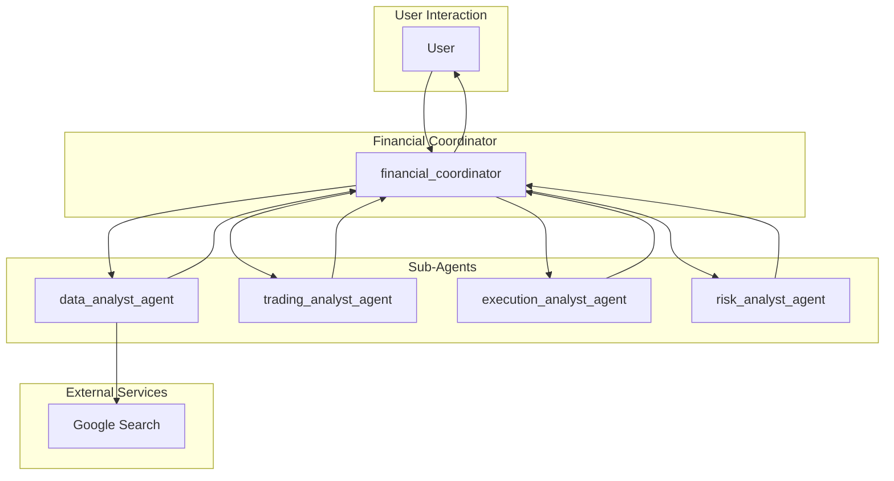

# Financial Advisor Agent - Architectural Document

## 1. Overview

The Financial Advisor is a multi-agent system designed to assist human financial advisors by providing in-depth market analysis, developing trading strategies, creating execution plans, and evaluating risks. The system is composed of a team of specialized AI agents, each responsible for a specific part of the financial advisory process.

## 2. Architectural Pattern: Sequential Pipeline with a Coordinator

The system follows a **Sequential Pipeline with a Coordinator** pattern. A `financial_coordinator` agent orchestrates the workflow, guiding the user through a structured process. Each step in the process is handled by a specialized sub-agent, and the output of one agent serves as the input for the next, forming a pipeline of information flow.

### 2.1. Components

*   **Financial Coordinator (`financial_coordinator`):** The central orchestrator of the system. It is responsible for:
    *   Interacting with the user and guiding them through the financial advisory process.
    *   Invoking the specialized sub-agents in the correct order.
    *   Managing the data flow between the agents.

*   **Data Analyst Agent (`data_analyst_agent`):** A specialized sub-agent responsible for:
    *   Gathering in-depth and current market analysis for a specific stock ticker using Google Search.
    *   Compiling a structured report based on the collected data.

*   **Trading Analyst Agent (`trading_analyst_agent`):** A specialized sub-agent that:
    *   Develops at least five different trading strategies based on the market analysis provided by the `data_analyst_agent`.
    *   Tailors the strategies to the user's risk tolerance and investment duration.

*   **Execution Analyst Agent (`execution_analyst_agent`):** A specialized sub-agent that:
    *   Creates a detailed and well-justified plan for implementing a given trading strategy.
    *   Adjusts the plan to fit the user's risk tolerance, investment timeframe, and execution preferences.

*   **Risk Analyst Agent (`risk_analyst_agent`):** A specialized sub-agent that:
    *   Produces a detailed and reasoned analysis of the risks associated with a specific trading strategy and its execution plan.
    *   Suggests concrete, actionable steps to mitigate the identified risks.

*   **Tools:**
    *   **Google Search:** Used by the `data_analyst_agent` to gather market data and news.

## 3. Detailed Workflow and Data Flow

The following diagram illustrates the detailed workflow and data flow between the agents:

### 3.1. Step-by-Step Workflow

1.  **Market Analysis:** The `financial_coordinator` starts by invoking the `data_analyst_agent` to gather comprehensive market data for a user-provided stock ticker.

2.  **Trading Strategy Development:** The `financial_coordinator` then passes the market analysis to the `trading_analyst_agent`, which develops a set of potential trading strategies tailored to the user's risk profile.

3.  **Execution Plan Definition:** Next, the `financial_coordinator` invokes the `execution_analyst_agent` to create a detailed execution plan for a selected trading strategy.

4.  **Risk Evaluation:** Finally, the `financial_coordinator` calls the `risk_analyst_agent` to provide a comprehensive risk assessment of the proposed plan.

5.  **Output:** The `financial_coordinator` presents the final analysis, strategies, execution plan, and risk assessment to the user.

## 4. Implementation Details

*   **Framework:** The agent is built using the ADK (Agent Development Kit).
*   **Model:** The language model used for the agents is a Gemini model.
*   **Tools:** The `data_analyst_agent` uses the built-in `google_search` tool.
