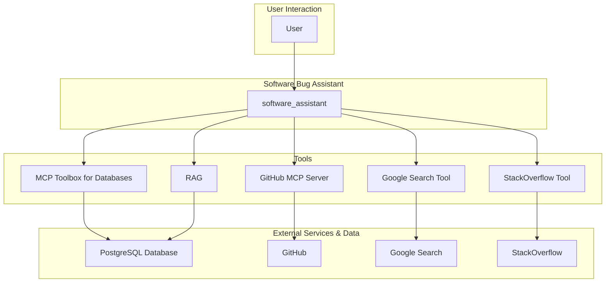

# Software Bug Assistant - Architectural Document

## 1. Overview

The Software Bug Assistant is a Python-based agent designed to assist IT Support and Software Developers in triaging, managing, and resolving software issues. It integrates with a variety of tools and services, including a PostgreSQL database for internal bug tickets, a GitHub MCP server for external tickets, RAG for information retrieval, Google Search, and StackOverflow.

## 2. Architectural Pattern: Single-Agent with a Toolbox

The agent follows a **Single-Agent with a Toolbox** pattern. A single `software_assistant` agent handles all interactions with the user, and it is equipped with a comprehensive set of tools to perform various tasks related to bug tracking and resolution.

### 2.1. Components

*   **Software Bug Assistant (`software_assistant`):** The core of the system, responsible for:
    *   Interacting with the user in a conversational manner.
    *   Understanding the user's needs and intent related to software bugs.
    *   Selecting and executing the appropriate tools to fulfill the user's requests.
    *   Managing the conversation flow and maintaining context.

*   **MCP Toolbox for Databases:** A Model Context Protocol (MCP) server that provides a set of "tools" for interacting with the internal PostgreSQL database of bug tickets.

*   **GitHub MCP Server:** A remote MCP server that allows the agent to fetch external software bugs (open issues, pull requests, etc.) from GitHub.

*   **Google Search Tool:** A tool that allows the agent to perform web searches to find information relevant to debugging and resolving software issues.

*   **StackOverflow Tool:** A tool that allows the agent to query StackOverflow's Q&A data.

*   **RAG (Retrieval-Augmented Generation):** The agent uses RAG to retrieve relevant information from the internal bug ticket database, leveraging Cloud SQL's built-in Vertex AI ML Integration.

*   **PostgreSQL Database:** A relational database that stores the internal bug tickets.

## 3. Detailed Workflow and Data Flow

The following diagram illustrates the detailed workflow and data flow of the agent:

### 3.1. Step-by-Step Workflow

1.  **User Request:** The user submits a request to the `software_assistant` (e.g., "Find all open internal tickets related to database timeouts," "Are there any discussions on StackOverflow about CVE-2024-3094?").

2.  **Intent Recognition:** The agent analyzes the user's request to understand their intent.

3.  **Tool Selection and Execution:** Based on the user's intent, the agent selects and executes the appropriate tool(s):
    *   For internal bug tickets, the agent uses the **MCP Toolbox** or **RAG**.
    *   For external bugs, the agent uses the **GitHub MCP Server**.
    *   For general research, the agent uses the **Google Search Tool**.
    *   For specific technical questions, the agent uses the **StackOverflow Tool**.

4.  **Response Generation:** The agent uses the output from the tools to generate a response to the user, often formatting the results in a human-readable format.

5.  **Conversation Management:** The agent maintains the context of the conversation, allowing for follow-up questions and a natural interaction.

## 4. Implementation Details

*   **Framework:** The agent is built using the ADK (Agent Development Kit).
*   **Model:** The language model used for the agent is a Gemini model.
*   **Database Integration:** The agent connects to the PostgreSQL database via the MCP Toolbox for Databases and uses RAG for information retrieval.
