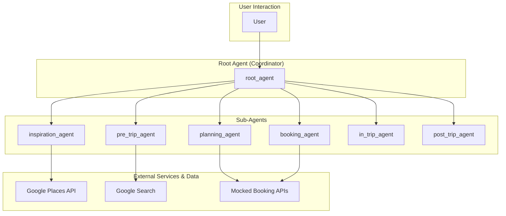

# Travel Concierge Agent - Architectural Document

## 1. Overview

The Travel Concierge is a multi-agent system designed to provide a comprehensive and personalized travel experience. It assists travelers with every stage of their journey, from trip inspiration and planning to in-trip assistance and post-trip feedback. The system is composed of a team of specialized AI agents, each responsible for a specific part of the travel lifecycle.

## 2. Architectural Pattern: Multi-Agent System with a Coordinator

The system is architected as a **Multi-Agent System with a Coordinator**. A `root_agent` acts as the central coordinator, managing the overall workflow and delegating tasks to a set of specialized sub-agents. This modular architecture allows for a clear separation of concerns and enables the system to handle the complexities of the travel planning process.

### 2.1. Components

*   **Root Agent (`root_agent`):** The central coordinator of the system. It is responsible for:
    *   Interacting with the user and guiding them through the travel planning process.
    *   Invoking the specialized sub-agents based on the user's needs and the current stage of the trip.
    *   Managing the data flow between the agents.

*   **Inspiration Agent (`inspiration_agent`):** A specialized sub-agent that helps users with:
    *   Generating vacation ideas and destination suggestions.
    *   Planning activities and points of interest.

*   **Planning Agent (`planning_agent`):** A specialized sub-agent that assists with:
    *   Finding and selecting flights and hotels (using mocked tools).
    *   Creating a detailed itinerary.

*   **Booking Agent (`booking_agent`):** A specialized sub-agent that handles:
    *   Processing payments for flights, hotels, and other bookings (using mocked tools).

*   **Pre-trip Agent (`pre_trip_agent`):** A specialized sub-agent that provides information about:
    *   Visa and medical requirements.
    *   Travel advisories.
    *   Weather forecasts.

*   **In-trip Agent (`in_trip_agent`):** A specialized sub-agent that offers:
    *   Real-time monitoring of bookings for any changes.
    *   Information and guidance during the trip.
    *   Transit assistance.

*   **Post-trip Agent (`post_trip_agent`):** A specialized sub-agent that:
    *   Collects feedback from the user about their trip.
    *   Identifies and stores user preferences for future travel planning.

*   **Tools:**
    *   **Google Places API:** Used by the `inspiration_agent` to find destinations and points of interest.
    *   **Google Search:** Used by the `pre_trip_agent` for information gathering.
    *   **Mocked Booking Tools:** A set of tools that simulate flight and hotel search, selection, and booking.

## 3. Detailed Workflow and Data Flow

The following diagram illustrates the detailed workflow and data flow between the agents:

### 3.1. Step-by-Step Workflow

1.  **Inspiration:** The user interacts with the `inspiration_agent` to get ideas for their trip.
2.  **Planning:** Once a destination is chosen, the `planning_agent` helps the user create a detailed itinerary.
3.  **Booking:** The `booking_agent` handles the payment for the trip.
4.  **Pre-trip:** Before the trip, the `pre_trip_agent` provides the user with important information.
5.  **In-trip:** During the trip, the `in_trip_agent` provides real-time assistance.
6.  **Post-trip:** After the trip, the `post_trip_agent` collects feedback and updates the user's profile.

## 4. Implementation Details

*   **Framework:** The agent is built using the ADK (Agent Development Kit).
*   **Model:** The language model used for the agents is a Gemini model.
*   **Tools:** The agent uses a combination of real and mocked tools to provide a comprehensive travel concierge experience.
